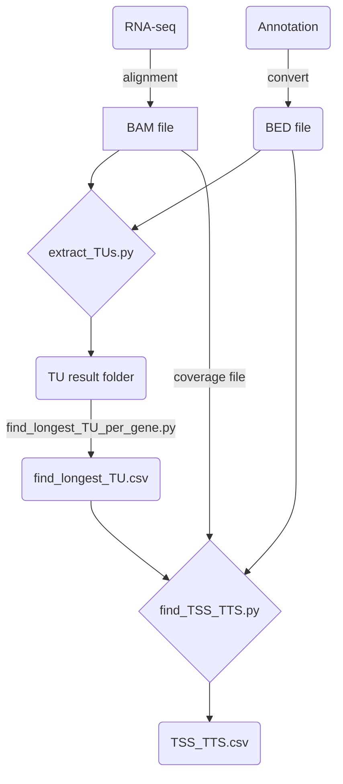

# TUFinder (Still developing)
An integrated tool for analyzing transcription units (TUs) in prokaryotes using RNA-seq data, with functionalities for identifying transcription start sites (TSS) and transcription termination sites (TTS).
## workflow

